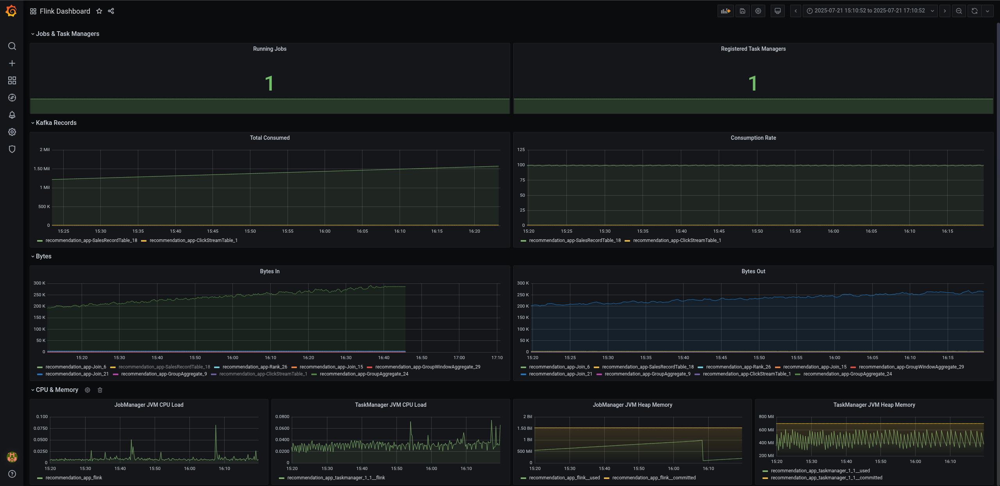

= Monitoring metrics

[NOTE]
====
This section assumes the following:

- You are in the `+examples/metrics/+` directory.
- You have deployed the https://github.com/streamshub/flink-sql-examples/tree/8057d63691100a2de09d6964444694cde249d376/tutorials/recommendation-app[`recomendatiion-app` example].
====

== Integrating Prometheus into Flink cluster

=== Installing Prometheus

Depending on whether you're using Kubernetes or OpenShift, you will have to
follow different steps to set up Prometheus.

==== Kubernetes

After deploying a Flink cluster, you can deploy Prometheus to monitor
metrics from the job manager and task manager by following these steps:

. Export the IP addresses of the Flink pods to scrape from:
+
[source,bash]
----
export OPERATOR_POD_IP=`kubectl get pods -lapp.kubernetes.io/name=flink-kubernetes-operator -n flink -o=jsonpath="{range .items[*]}{.status.podIP}{','}{end}" | cut -d ',' -f1`

export JOB_MANAGER_POD_IP=`kubectl get pods -lapp=recommendation-app -n flink -o=jsonpath="{range .items[*]}{.status.podIP}{','}{end}" | cut -d ',' -f1`

export TASK_MANAGER_POD_IP=`kubectl get pods -lapp=recommendation-app -n flink -o=jsonpath="{range .items[*]}{.status.podIP}{','}{end}" | cut -d ',' -f2`
----
+
[NOTE]
====
Here we assume there’s only:

* 1 Flink kubernetes operator
* 1 job
manager
* 1 task manager

If you deployed more than that, please update the `+prometheus-config.yaml+` file.
====
+
. Install the provided Prometheus server, configuration, and `+Service+` CRs:
+
[source,bash]
----
for f in prometheus-install/kubernetes_monitor_example/*.yaml;
do
  envsubst < $f | kubectl apply -f -;
done
----
+
. Expose the Prometheus UI with a port-forward rule:
+
[source,bash]
----
kubectl port-forward svc/prometheus-service -n flink 9090
----
. Now, you can monitor the metrics in the Flink kubernetes operator, job
manager, or task manager via the Prometheus UI accessible at
`+localhost:9090+`.
+
image:images/operator_metric.png[img.png]
+
image:images/job_metric.png[img.png]
+
image:images/task_metric.png[img.png]

==== OpenShift

NOTE: Make sure you have enabled https://docs.redhat.com/en/documentation/openshift_container_platform/4.19/html/monitoring/configuring-user-workload-monitoring#enabling-monitoring-for-user-defined-projects-uwm_preparing-to-configure-the-monitoring-stack-uwm[monitoring for user-defined projects].

Since OpenShift comes with Prometheus built-in and pre-configured,
we can integrate with it by deploying a `+PodMonitor+` CR
for the Flink cluster:

. Install the pre-configured `+PodMonitor+`, `+Service+`, and
`+serviceMonitor+` CRs:
+
[source,bash]
----
oc apply -f prometheus-install/openshift_monitor_example -n flink
----
+
NOTE: These CRs are pre-configured to select the Flink kubernetes operator
and `+FlinkDeployment+` created as part of the `+recommendation-app+`
example. Please update the `+selector.matchLabels+` field in
`+flink-monitor.yaml+` if you are running a different example.
. It takes around 5 minutes for the Prometheus operator to update
the config for the Prometheus server. After that, you can query the metrics
in the OpenShift UI as described
https://docs.redhat.com/en/documentation/openshift_container_platform/4.19/html/monitoring/accessing-metrics[here].
+
image:images/openshift_operator.png[img.png]
+
image:images/openshift_jobmanager.png[img.png]
+
image:images/openshift_taskmanager.png[img.png]

== Integrating Grafana into Flink cluster

Depending on whether you're using Kubernetes or OpenShift, you will have to
follow different steps to set up Grafana.

=== Installing Grafana

==== Kubernetes

After deploying Prometheus, you can deploy Grafana to create dashboards and visualize the data.

. Install the provided Grafana server, service, datasources, and example Flink dashboard:
+
[source,bash]
----
kubectl apply -f grafana-install/kubernetes_grafana_example/grafana-datasources.yaml -n flink

kubectl apply -f grafana-install -n flink
----
+
NOTE: `grafana-datasources.yaml` is pre-configured to connect to the Prometheus server from
the previous section.

==== OpenShift

Since our Grafana deployment will need to fetch data from OpenShift's Prometheus instance,
we need to create a `+ServiceAccount+` with the right permissions and pass its token to Grafana.

. Create a `ServiceAccount` with permissions for monitoring:
+
[source,bash]
----
oc project openshift-user-workload-monitoring

oc create sa grafana-sa

oc adm policy add-cluster-role-to-user cluster-monitoring-view -z grafana-sa
----
+
. Create a token for the `+ServiceAccount+`, then apply a Grafana datasource containing the token:
+
[source,bash]
----
export PROMETHEUS_TOKEN=`oc -n openshift-user-workload-monitoring create token grafana-sa`

cat grafana-install/openshift_grafana_example/grafana-datasources.yaml | envsubst | oc apply -n flink -f -
----
+
NOTE: In production, you should https://kubernetes.io/docs/reference/access-authn-authz/service-accounts-admin/#bound-service-account-tokens[bind the token to an object].
+
. Install the provided Grafana server, service, and example Flink dashboard:
+
[source,bash]
----
oc apply -f grafana-install -n flink
----

=== Viewing the example dashboard

After confirming the Grafana deployment is running, we can expose it with a port-forward rule:

[source,bash]
----
kubectl port-forward svc/grafana-service -n flink 3000
----

NOTE: The default Grafana username and password are both `admin`.

Upon logging in to the Grafana UI, you should be greeted with the provided example Flink dashboard.

