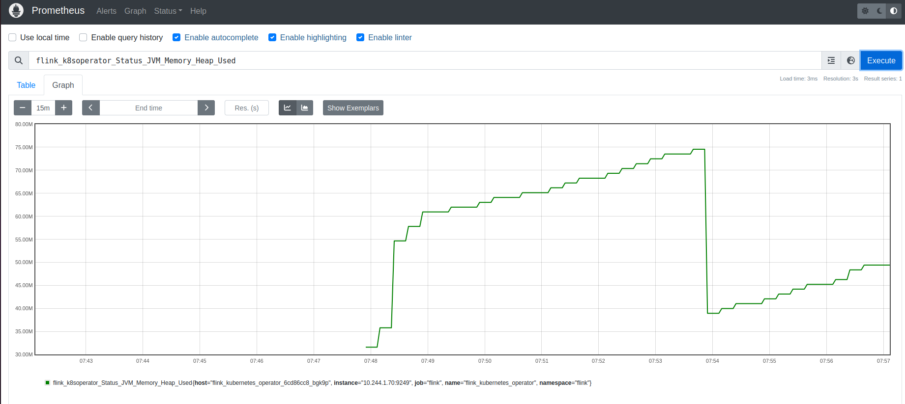
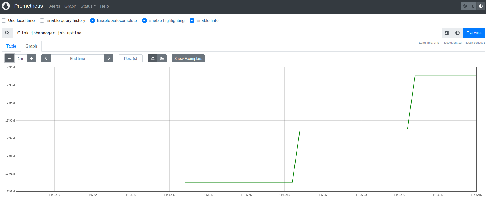
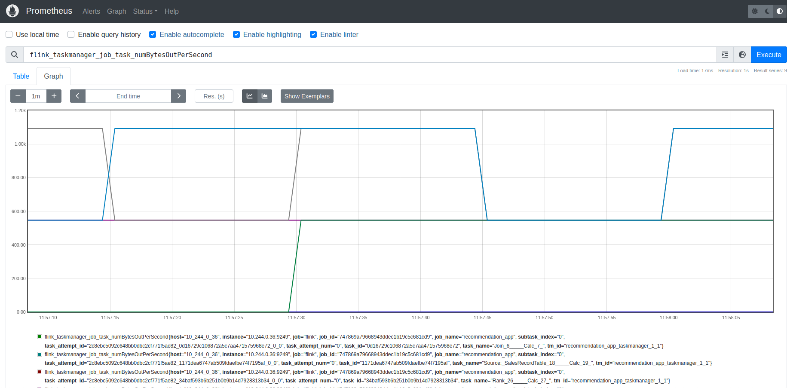
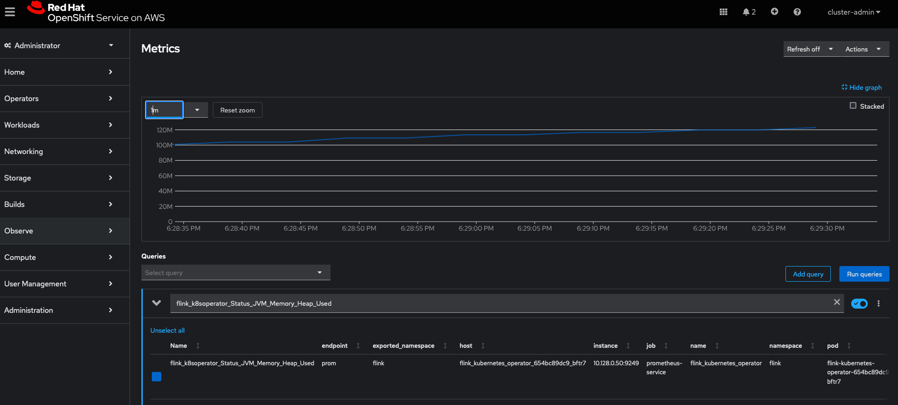
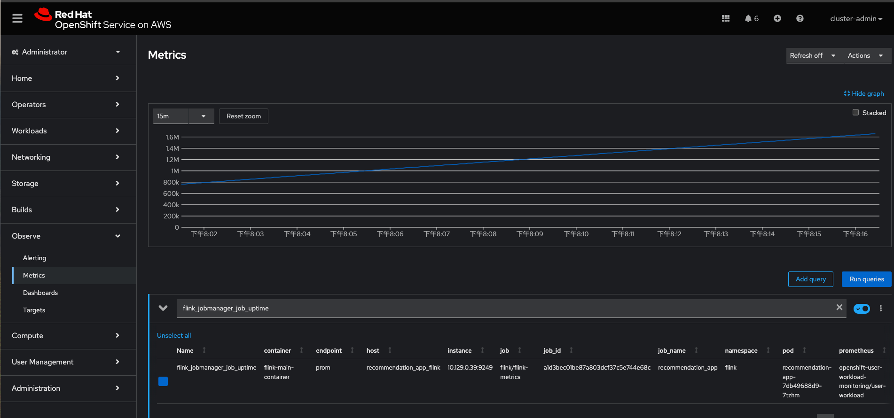

# Integrate Prometheus into Flink cluster

After deploying Flink cluster, you can then deploy Prometheus to monitor the metrics from job manager and task manager by following these steps:

1. Update the Prometheus configuration with the IP address of Flink pods to scrape from:

   **Linux:**
   ```
   sed -i s/OPERATOR/$(kubectl get pods -lapp.kubernetes.io/name=flink-kubernetes-operator -n flink -o=jsonpath="{range .items[*]}{.status.podIP}{','}{end}" | cut -d ',' -f1)/g prometheus-install/prometheus-config.yaml
   sed -i s/JOB_MANAGER/$(kubectl get pods -lapp=recommendation-app -n flink -o=jsonpath="{range .items[*]}{.status.podIP}{','}{end}" | cut -d ',' -f1)/g prometheus-install/prometheus-config.yaml
   sed -i s/TASK_MANAGER/$(kubectl get pods -lapp=recommendation-app -n flink -o=jsonpath="{range .items[*]}{.status.podIP}{','}{end}" | cut -d ',' -f2)/g prometheus-install/prometheus-config.yaml
   ```
   **MacOS**
   ```
   sed -i '' s/JOB_MANAGER/$(kubectl get pods -lapp.kubernetes.io/name=flink-kubernetes-operator -n flink -o=jsonpath="{range .items[*]}{.status.podIP}{','}{end}" | cut -d ',' -f1)/g prometheus-install/prometheus-config.yaml
   sed -i '' s/JOB_MANAGER/$(kubectl get pods -lapp=recommendation-app -n flink -o=jsonpath="{range .items[*]}{.status.podIP}{','}{end}" | cut -d ',' -f1)/g prometheus-install/prometheus-config.yaml
   sed -i '' s/TASK_MANAGER/$(kubectl get pods -lapp=recommendation-app -n flink -o=jsonpath="{range .items[*]}{.status.podIP}{','}{end}" | cut -d ',' -f2)/g prometheus-install/prometheus-config.yaml
   ```
   Note: Here we assume there's only 1 flink kubernetes operator, 1 job manager, and 1 task manager. If you deployed more than that, please update the `prometheus-config.yaml` file.

2. Install prometheus, configuration, and service:
   ```
   kubectl apply -f prometheus-install -n flink
   ```

3. Expose the prometheus UI with port-forward rule:
   ```
   kubectl port-forward svc/prometheus-service -n flink 9090
   ```
4. Now you can monitor the metrics in flink kubernetes operator, job manager or task manager via the Prometheus UI is accessible at localhost:9090.




# Integrate Prometheus into Flink cluster deployed on OpenShift

Since Openshift already has a built-in Prometheus installed and configured, we can integrate with it by deploying a `PodMonitor` CR for the flink cluster:

1. Install the pre-configured `PodMonitor`, `service`, and `serviceMonitor` CRs:
   ```
   oc apply -f prometheus-install/openshift_monitor_example -n flink
   ```
   Note: These CRs are configured to select the Flink kubernetes operator, and
   `FlinkDeployment` created as part of the `recommendation-app` example.
   Please update the `selector.matchLabels` field in `flink-monitor.yaml` if you are running a different example.

2. It takes around 5 minutes to wait for prometheus operator to update the config for prometheus server. After that, you can query the metrics in the OpenShift UI as described [here](https://docs.openshift.com/container-platform/4.16/observability/monitoring/managing-metrics.html#querying-metrics-for-all-projects-as-an-administrator_managing-metrics).




       
